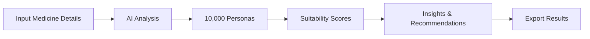

# PharmaDrishti 💊
### AI-Powered Pharmaceutical Market Intelligence Platform

<div align="center">

**Transform pharmaceutical market research from months to minutes**


</div>

---

## 🎯 Executive Summary

PharmaDrishti is a simulation-driven pharmaceutical market intelligence system designed to estimate product adoption probability across heterogeneous demographic and economic segments in India.

The system integrates:

- Large-scale synthetic persona modeling
- Multi-factor adoption scoring
- Gradient-boosted regression (XGBoost)
- SHAP-based feature attribution
- Scenario-based pricing simulation

Predictions are generated in under 5 seconds using a pre-trained model calibrated on large-scale simulated interaction data.

---

## 🚀 Quick Start

```bash
# 1. Install dependencies
pip install -r requirements.txt

# 2. Run dashboard
cd pharmadrishti
streamlit run dashboard.py
```

**Dashboard opens at:** `http://localhost:8501`

---

## ✨ Key Features

<table>
<tr>
<td width="50%">

### 🎯 Multi-Factor Analysis
- **Disease Match** (35%)
- **Affordability** (25%)
- **Manufacturing** (15%)
- **Brand Alignment** (15%)
- **Risk Tolerance** (10%)

</td>
<td width="50%">

### 🤖 AI-Powered Insights
- Explains WHY scores are what they are
- Identifies specific barriers
- Actionable recommendations
- Expected impact predictions

</td>
</tr>
<tr>
<td width="50%">

### 📊 Interactive Dashboard
- Real-time predictions (< 5 sec)
- Visual analytics & charts
- Scenario comparison
- CSV export for presentations

</td>
<td width="50%">

### 🔬 Robust ML Model
- 50M training samples
- R² score > 0.85
- XGBoost algorithm
- Explainable AI (SHAP)

</td>
</tr>
</table>

---

## 💡 How It Works



### 1. Configure Your Medicine
- Target disease
- Batch price (₹5K-₹500K)
- Manufacturing score
- Brand strength
- Side effect risk
- Insurance compatibility under schemes

### 2. AI Analysis
- Analyzes across 10,000 diverse personas
- Calculates multi-factor suitability scores
- Generates segment-level insights

### 3. Get Results
- Overall suitability score
- Best target segments
- Revenue estimates
- AI-powered recommendations

---
## 📊 Data Simulation Framework

The training dataset is generated using a large-scale synthetic interaction engine:

- 10,000 demographic personas
- 5,000 simulated pharmaceutical products
- 50,000,000 persona–medicine interactions

Each interaction encodes:

- Disease relevance
- Price-to-income ratio
- Insurance coverage compatibility
- Manufacturing accessibility
- Brand strength
- Risk tolerance alignment

The resulting dataset is used to train a supervised regression model to predict adoption suitability score.

---


### ROI Example
**Mid-Size Pharma Company** (5 products/year)
- Traditional Cost: ₹5Cr
- PharmaDrishti: ₹25L
- **Annual Savings: ₹4.75Cr**
- **ROI: 1,900%**

---

## 🎓 Use Cases

### 1. Batch Pricing Optimization
Test multiple price points to maximize revenue vs adoption

**Example:**
- ₹30K: 82% adoption, ₹24.6Cr revenue
- ₹80K: 51% adoption, ₹40.8Cr revenue
- **Recommendation:** Tiered pricing by city tier

### 2. Manufacturing Assessment
Evaluate manufacturing capability for target markets

**Example:**
- Tier 1: 68% adoption (high manufacturing access)
- Tier 3: 23% adoption (manufacturing barrier)
- **Recommendation:** Partner with local manufacturers

### 3. Market Segmentation
Identify optimal target demographics for phased launch

**Example:**
- Tier 1, High Income: 85% adoption
- Tier 2, Middle Income: 62% adoption
- **Recommendation:** Start Tier 1, expand after 6 months

---

**Model Performance (Synthetic Validation):**
- R² Score: > 0.85
- Training Time: 15–30 minutes
- Memory Requirement: 8–16GB RAM
- Model Size: ~50–100 MB

---

## 📊 Dashboard Guide

### Input Parameters

| Parameter | Range | Description |
|-----------|-------|-------------|
| **Target Disease** | Dropdown | Disease medicine treats |
| **Batch Price** | ₹5K-₹500K | Medicine batch price |
| **Launch Locality** | Dropdown | State or Pan-India |
| **Brand Strength** | 0.0-1.0 | Generic to Premium |
| **Side Effect Risk** | 0.0-1.0 | Safe to High Risk |
| **Manufacturing Score** | 0.0-1.0 | Limited to High Capability |
| **Insurance under Schemes** | 0.0-1.0 | Not Covered to Fully Covered |

### Score Interpretation

| Score Range | Interpretation |
|-------------|----------------|
| 70–100 | High predicted adoption suitability |
| 40–70 | Moderate suitability |
| 0–40 | Low suitability |

---

### Core Modules

1. Persona Generator – Constructs demographic and economic distributions
2. Interaction Engine – Simulates adoption score per persona-product pair
3. Model Trainer – Trains gradient boosting regressor
4. Prediction Engine – Real-time inference
5. SHAP Analyzer – Feature importance attribution
6. Insight Layer – LLM-assisted recommendation synthesis

```
┌─────────────────────────────────────┐
│      Streamlit Dashboard            │
│                                     │
└──────────────┬──────────────────────┘
               │
               ▼
┌─────────────────────────────────────┐
│  Persona Manager | Prediction Engine│
│  Insights Generator (Gemini AI)     │
└──────────────┬──────────────────────┘
               │
               ▼
┌─────────────────────────────────────┐
│  10K Personas | XGBoost Model       │
│  50M Interactions                   │
└─────────────────────────────────────┘
```

### Technology Stack
- **Frontend:** Streamlit 
- **ML:** XGBoost, SHAP
- **AI:** Google Gemini
- **Data:** Pandas, NumPy
- **Viz:** Plotly

---

## 📚 Documentation

| Document | Description |
|----------|-------------|
| **README.md** | This file - overview |
| **DASHBOARD_SETUP.md** | Detailed setup guide |
| **FEATURES.md** | Complete feature docs |
| **QUICK_REFERENCE.md** | Quick reference card |
| **PERSONA_GENERATION_SUMMARY.md** | 10K persona statistics |

---

## 🎯 System Metrics

| Metric | Value |
|--------|--------|
| Personas | 10,000 |
| Simulated Interactions | 50,000,000 |
| Diseases Modeled | 10 |
| Model Type | XGBoost Regressor |
| Validation R² | > 0.85 (synthetic dataset) |
| Training Time | 15–30 minutes |
| Prediction Latency | < 5 seconds |
| Model Size | ~50–100 MB |
| Geographic Modeling | 10 states, 25+ cities |

---

## 🔧 Troubleshooting

### Dashboard Won't Start
```bash
pip install -r requirements.txt
streamlit run dashboard.py --server.port 8502
```

### AI Insights Missing
- Configure Gemini API key
- Check internet connection
- Verify key at [Google AI Studio](https://makersuite.google.com/app/apikey)

### Model Training Fails
- Ensure 16GB+ RAM
- Check disk space (5GB+)
- Reduce dataset size temporarily

---

## 🗺️ Roadmap

### ✅ Phase 1: MVP (Completed)
- [x] 10,000 diverse personas
- [x] 50M interaction dataset
- [x] XGBoost prediction model
- [x] Interactive dashboard
- [x] AI-powered insights

### 📅 Phase 2: Q1 2026
- [ ] 20,000+ personas
- [ ] 20+ disease categories
- [ ] NPPA pricing integration
- [ ] Competitive analysis
- [ ] Mobile responsive design

### 📅 Phase 3: Q2 2026
- [ ] Pilot with pharma companies
- [ ] Real launch validation
- [ ] Case studies
- [ ] API access

### 📅 Phase 4: Q3-Q4 2026
- [ ] SaaS platform
- [ ] Enterprise features
- [ ] Mobile app
- [ ] Multi-language support


---

## ⚠️ Limitations

- Current implementation relies on synthetic data simulation
- Does not model physician prescription behavior
- Does not incorporate regulatory approval timelines
- No real-world post-launch validation integrated yet
- Economic and insurance parameters are modeled assumptions

---


